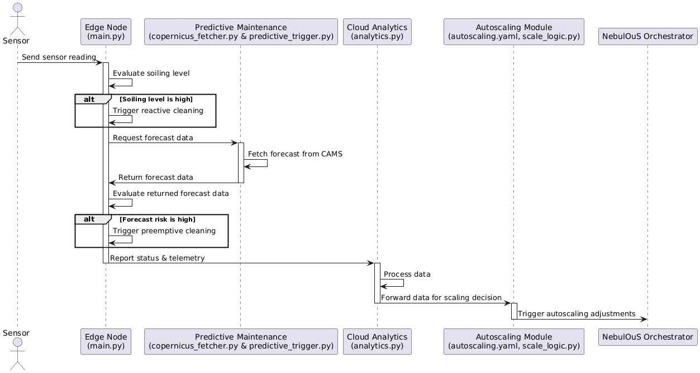
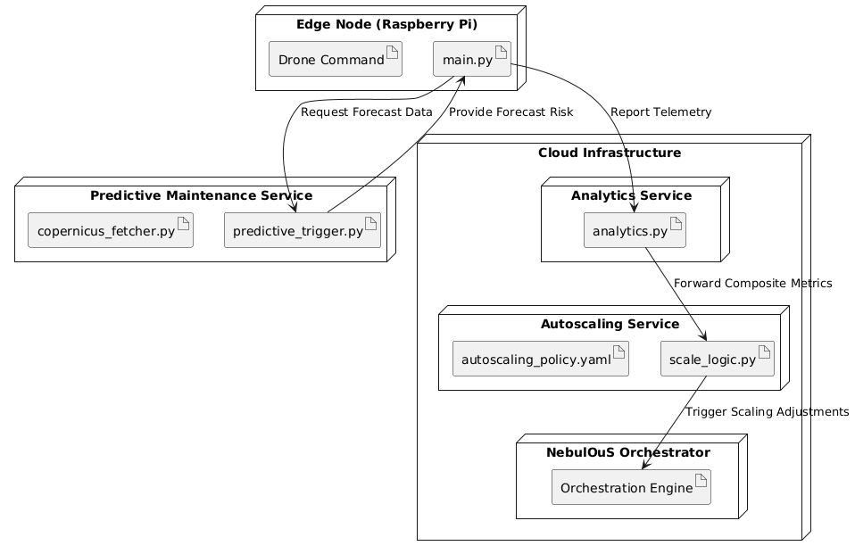
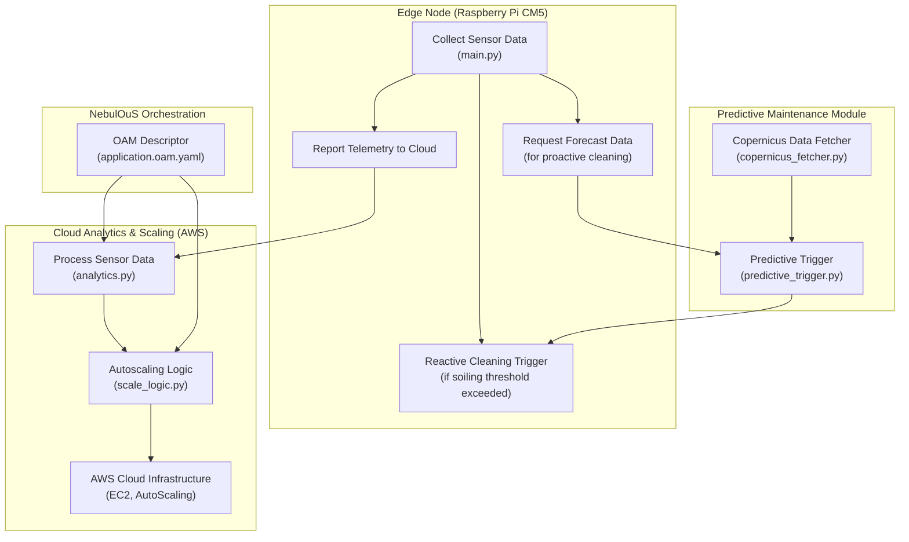

# AIr4LifeOnTheEdge – NebulOuS Technical Validation

Welcome to the technical validation repository for **AIr4LifeOnTheEdge**, an autonomous drone cleaning solution designed for persistent edge‑cloud orchestration in automated infrastructure maintenance. This repository demonstrates compliance with NebulOuS Open Call #2, Challenge #2 (IoT Application) by highlighting deployability, modularity, predictive maintenance capabilities, and integration-readiness.

## Repository Structure

    /demo/
       - Field validation video (Almería), field photos, and the Energies publication.
    /edge/
       - Sensor and drone control scripts, Dockerfile, requirements, and container build/run instructions.
    /cloud/
       - Kubernetes deployment files, Open Application Model (OAM) descriptors, autoscaling configurations, and cloud analytics scripts.
    /scaling/
       - Autoscaling logic and configuration for edge/cloud scaling demonstration.
    /predictive_maintenance/
       - Copernicus data fetcher, predictive cleaning trigger logic, and workflow documentation.
    /hardware/
       - Raspberry Pi CM5 specifications (Ubuntu 22.04, 4 CPU cores/8GB RAM), LTE modem setup details, and public-IP configuration.

 

## What’s Included – Validation Highlights

- **Field Evidence:**  
  - Real-world demonstration video and field photos are available in `/demo/`.  
  - Peer-reviewed publication (DOI/PDF link provided in `/demo/`).

- **Predictive & Reactive Maintenance:**  
  - The `/predictive_maintenance/` module demonstrates planned integration with Copernicus (or similar forecasts) to trigger preemptive cleaning, in addition to reactive triggers based on sensor data.

- **Modular, Deployment-Ready Code:**  
  - All critical components (edge, cloud, scaling) are containerized using Docker and orchestrated via Kubernetes.  
  - Build and run instructions are provided within each respective folder.

- **Scalable, SLA-Driven Architecture:**  
  - Example Kubernetes manifests, OAM descriptors, and autoscaling policies are provided to showcase dynamic scaling and workload management, ensuring the system can adapt to burst loads and varying operational demands.

## NebulOuS Integration Plan

- **Modularity & Containerization:**  
  All components are built as separate, containerized microservices ready to be deployed using NebulOuS’s Open Application Model (OAM).

- **Edge Node Accessibility:**  
  Edge nodes run on Raspberry Pi Compute Module 5 (Ubuntu 22.04) with public IP accessibility (via LTE modem) to support NebulOuS automated, remote orchestration.

- **Predictive Maintenance Pipeline:**  
  The system leverages (currently simulated) Copernicus API data to trigger preemptive cleaning and scaling actions — this integration will be expanded during the project.

- **Field-Validated & SLA-Driven:**  
  The complete pipeline has been validated in the field with demonstrated improvements in cleaning performance, scalability, and resource efficiency. Further NebulOuS-specific enhancements are planned.

## Deployment Diagram

Refer to the Deployment Diagram provided in the `/image/` folder (or related documentation) for a visual flow of system interactions.

## Usage & Quickstart

- **Edge Node:**  
  See `/edge/README.md` for detailed instructions on local execution and Docker build commands.

- **Cloud Deployment:**  
  Use the Kubernetes deployment file (`/cloud/kube-deployment.yaml`) to deploy the cloud component. The provided OAM descriptors facilitate future integration with the NebulOuS orchestration layer.

- **Predictive Maintenance Simulation:**  
  Run the script `/predictive_maintenance/predictive_trigger.py` to simulate the predictive cleaning triggers based on forecast data.

- **Autoscaling Demonstration:**  
  Check `/scaling/` for autoscaling policy examples and logic that demonstrate dynamic scaling mechanisms.

The components overview:

---

This repository aims to validate the technical eligibility of AIr4LifeOnTheEdge, confirming that our solution meets NebulOuS requirements while providing a clear path toward a fully integrated and scalable product.

