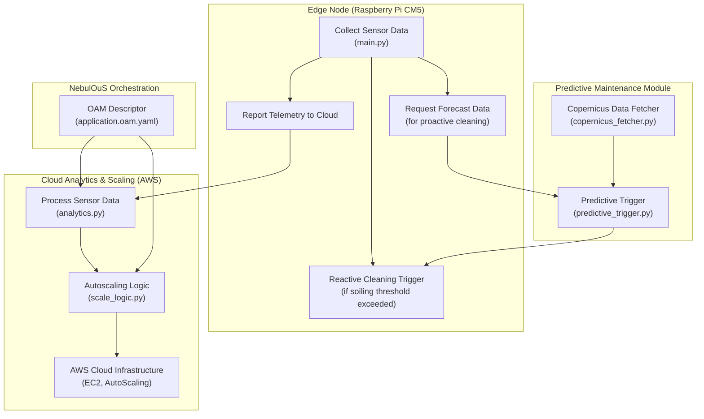

1. System Architecture

The solution consists of multiple modules working together:

    Edge Node (Raspberry Pi CM5):

        Collects sensor data (soiling levels) via main.py.

        Triggers cleaning reactively when sensor values exceed a threshold.

        Requests forecast data (simulated Copernicus integration) to make proactive cleaning decisions.

        Optionally reads additional performance data (e.g., current sensor from a solar panel) to validate cleaning effectiveness.

        Reports telemetry to the cloud for further analysis.

    Cloud Analytics Module (AWS-Based):

        Processes sensor data batches using analytics.py.

        Performs anomaly detection and triggers autoscaling actions when needed.

        Leverages AWS services (such as EC2 and auto-scaling groups defined via our minimal CloudFormation template in the /aws-deployment folder) to host a scalable backend.

        Integrates predictive maintenance by incorporating forecast data (via simulated Copernicus data).

    Predictive Maintenance Module:

        copernicus_fetcher.py fetches dust storm risk data from the Copernicus Atmosphere Monitoring Service (CAMS) or its simulated equivalent.

        predictive_trigger.py determines if preemptive cleaning should be activated based on forecasted risk.

    Autoscaling Module:

        Kubernetes Autoscaling: Managed using autoscaling.yaml with CPU utilization thresholds.

        Custom Scaling Logic: Provided by scale_logic.py, which adjusts resources based on sensor event rates and aggregated metrics.

        AWS Integration: Minimal AWS CloudFormation templates provision the cloud analytics backend and auto-scale EC2 instances, ensuring that the backend scales with demand.

    Deployment and Orchestration:

        All components are containerized using Docker and orchestrated via Kubernetes.

        An OAM descriptor (application.oam.yaml) integrates the edge-cleaner and predictive-trigger components for declarative deployment.

        AWS is used to host the cloud analytics engine, and auto-scaling is achieved both at the Kubernetes layer and via AWS services.

2. Data Flow & Integration

The overall interaction among components is as follows:

    Edge-to-Cloud Data Flow:

        Edge Node Reads Sensor Data: main.py captures environmental soiling levels. When the soiling exceeds a threshold, reactive cleaning is triggered.

        Predictive Maintenance: copernicus_fetcher.py retrieves forecast data, and predictive_trigger.py evaluates dust risk. If the risk is high, a preemptive cleaning trigger is activated.

        Cloud Processing: analytics.py processes the collected sensor data to detect anomalies and guide operational decisions. Autoscaling logic (defined in autoscaling.yaml and scale_logic.py) determines if resources should be adjusted.

        AWS & NebulOuS Orchestration: The NebulOuS Meta-OS oversees dynamic orchestration via OAM descriptors, while AWS supports scalable backend deployment. These ensure that the system adapts to workload fluctuations and environmental factors in real time.

3. NebulOuS and AWS Compliance

    Containerization & OAM:

        All components are fully containerized and orchestrated with Kubernetes using NebulOuS-compliant OAM descriptors.

    Dynamic Orchestration:

        NebulOuS manages deployment, scaling, and configuration reconfiguration dynamically.

    Cloud Analytics on AWS:

        A lean AWS CloudFormation template (in the /aws-deployment folder) provisions the essential cloud components (e.g., EC2 and auto-scaling environments) required for persistent backend analytics.

    Hardware Compliance:

        Edge nodes run Ubuntu 22.04 on Raspberry Pi CM5 with a minimum of 4 CPUs, 8GB RAM, and have an LTE modem for public-IP connectivity. This meets NebulOuS IoT device and network requirements.

4. Predictive Reconfiguration

    Forecast risk data from Copernicus (or its simulation) dynamically informs scaling decisions.

    Autoscaling ensures that cloud and edge resources can expand preemptively before environmental disruptions occur.

5. Future Enhancements

    Real API Integration for CAMS Data: Replace the current simulation in copernicus_fetcher.py with actual API calls and caching mechanisms for improved data fidelity.

    Advanced Monitoring & Visualization: Integrate Prometheus/Grafana dashboards for real-time insights into system performance and resource utilization.

    Automated SLA-Driven Reconfigurations: Enhance integration with NebulOuS orchestration APIs to support real-time SLA enforcement, ensuring that performance metrics trigger automatic reconfigurations.
        Deepen integration with NebulOuS orchestration APIs for real-time SLA enforcement.

AIr4LifeOnTheEdge is a fully integrated system combining edge data collection, cloud analytics, predictive maintenance, and autoscaling. Its architecture aligns with NebulOuS standards, ensuring seamless deployment, dynamic resource management, and proactive operational decision-making.
